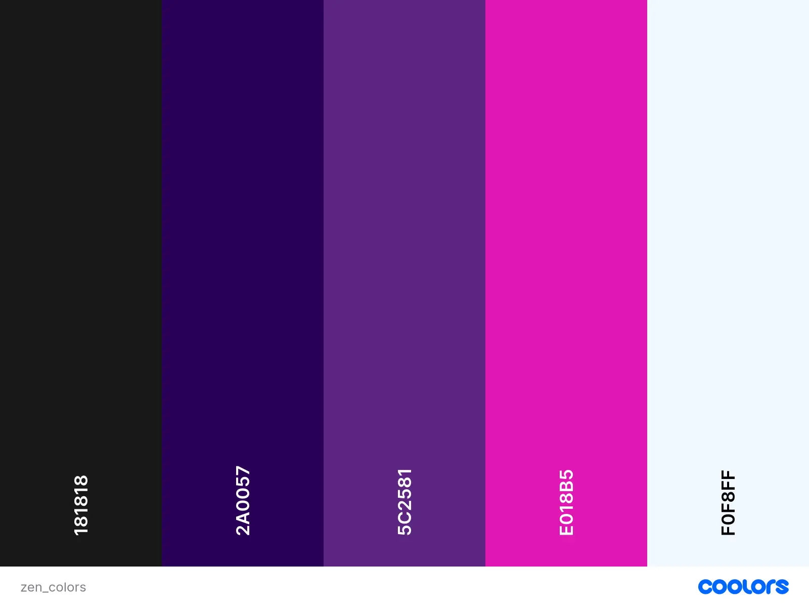

# Amelia-Quiz
## Mission statement
This website is to support my daughters revision for GCSE's in addition to her schools tuition.
## User Stories
### `Navigation`
* I want to navigate between the main game options and the home screen, so I know where I am going.
* I want to know which subject I have selected so that I know which quiz I am taking.
___
### `Home`
* I want to see subject options, so I can make an infomed decision of what game to play
* I want the available subjects to be clearly identifiable so that I can quickly choose a quiz.
* I want visual feedback when hovering or selecting a subject so that I know it is interactive.
___

### `Game`

* I want to see which question I am currently answering so that I know my progress through the quiz.
* I want to select one answer per question so that I can submit my response.
* I want my selected answers to remain selected when moving between questions so that I can review my choices.
* I want to see my final score when the quiz ends so that I can measure my performance.
* I want a variety of questions to be presented each time I play so that the quiz remains engaging and educational.
___

### `General`

* I want the application to be responsive on mobile, tablet, and desktop devices so that I can use it comfortably on any screen size.
* I want buttons and interactive controls to remain usable on touch devices so that I can complete quizzes without difficulty.

## Future Features

`Timed Mode`

-   As a user, I want to challenge myself with a countdown timer so that I can test my knowledge under pressure.

`Settings`

-   As a user, I want to turn sound effects on or off so that I can customise my experience.
-   As a user, I want to choose the number of questions in a quiz so that I can play shorter or longer games.

## Colour & Typography

### `Colour`

||Fonts|CTA Buttons|Shadow|Body|
|-|-|-|-|-|
|Carbon black - #181818|-|-|-|✅|
|Indigo Ink - #2a0057|✅|-|✅|✅|
|Indigo Velvet - #5c2581|✅|-|✅|-|
|Shocking Pink - #e018b5|-|-|✅|-|
|Alice Blue - #f0f8ff|✅|✅||-|

### `Fonts`

Roboto

## Wireframes

| Home | About me | Portfolio |

|---|---|---|

||||

## Technologies

### `Resources`

* HTML

* CSS

* Javascript

* VSCode
* [JSON Converter - GeeksforGeeks](https://www.geeksforgeeks.org/utilities/csv-to-json-converter/)
* [Font Awesome](https://fontawesome.com/icons)

* Microsoft Copilot

* [Google Fonts](https://fonts.google.com/)

* [JPG Converter | CloudConvert](https://cloudconvert.com/jpg-converter)

* [Min-Max-Value Interpolation](https://min-max-calculator.9elements.com/?16,24,320,1200)

* [CSS Gradient Generator - W3Schools](https://www.w3schools.com/tools/tool_css_gradient.php#gsc.tab=0&gsc.q=preserve%203d)

* [The W3C Markup Validation Service](https://validator.w3.org/)

* [JSHint, a JavaScript Code Quality Tool](https://jshint.com/)
* [Pixabay](https://pixabay.com/sound-effects/)

## Credits
* Sound Effect by <a href="https://pixabay.com/users/matthewvakaliuk73627-48347364/?utm_source=link-attribution&utm_medium=referral&utm_campaign=music&utm_content=290204">Matthew Vakalyuk</a> from <a href="https://pixabay.com//?utm_source=link-attribution&utm_medium=referral&utm_campaign=music&utm_content=290204">Pixabay</a>
* Sound Effect by <a href="https://pixabay.com/users/ksjsbwuil-50402086/?utm_source=link-attribution&utm_medium=referral&utm_campaign=music&utm_content=513897">ksjsbwuil</a> from <a href="https://pixabay.com//?utm_source=link-attribution&utm_medium=referral&utm_campaign=music&utm_content=513897">Pixabay</a>
* Sound Effect by <a href="https://pixabay.com/users/dragon-studio-38165424/?utm_source=link-attribution&utm_medium=referral&utm_campaign=music&utm_content=406644">DRAGON-STUDIO</a> from <a href="https://pixabay.com//?utm_source=link-attribution&utm_medium=referral&utm_campaign=music&utm_content=406644">Pixabay</a>

## Fixed bugs
[Click here to see the fixed bugs](./FIXEDBUGS.md)

## TESTING

Please click [here](../egbert/TESTING.md) to view application testing.

## LOCAL DEVELOPMENT

### Clone Repository

1. Login/Sign up to [GitHub](https://github.com/)

2. Go to the project repository [GitHub - 2ndborn/amelia-quiz · GitHub](https://github.com/2ndborn/amelia-quiz)

3. Click on the green code button, select whether you would like to clone with **HTTPS**, SSH or GitHub CLI and copy the link shown.

4. Open the terminal and type the following command in the terminal: 
<pre><code>python -m http.server
</code></pre>

5. You should see the following: 
<pre><code>➜ Local: http://localhost:8000/
*Click the Local: link to open the browswer*
</code></pre>

## Deployment

GitHub is used to host the repository.

#### 1. Go to the project repository [GitHub - 2ndborn/amelia-quiz · GitHub](https://github.com/2ndborn/amelia-quiz)
#### 2. Go to settings 
3. Under **code, planning, and automation** click on `Pages`.
4.  Under **Build and deployment >Branch**  change `None` to `Main`, the press `Save`.
5. You should see the live site address https://2ndborn.github.io/amelia-quiz/.